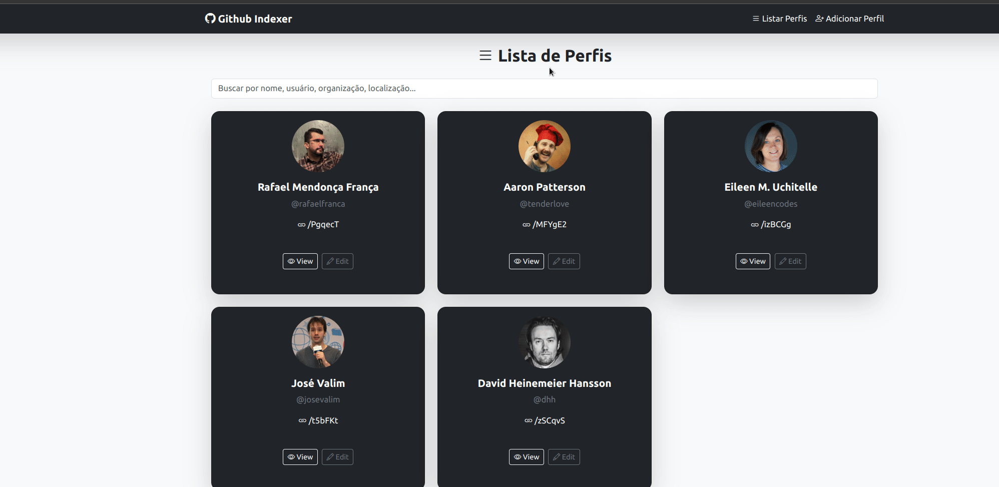

# GitHub Profiles Indexer

## Descrição

Aplicação Fullstack desenvolvida em **Ruby on Rails 8** para buscar, cadastrar e gerenciar perfis do GitHub.  
O sistema realiza scraping das informações do GitHub, exibe os perfis cadastrados e permite re-escanear, editar e excluir os registros.

### **Funcionalidades Principais**

- Cadastro de perfis com nome e URL do GitHub.
- Scraping automático para buscar nickname, número de seguidores, seguindo, estrelas, contribuições anuais, organização e localização.
- URLs encurtadas automaticamente para acesso rápido.
- Re-escaneamento manual das informações do GitHub.
- Busca de perfis pelo nome, nickname, organização ou localização.
- Listagem e visualização detalhada dos perfis.
- Edição do nome e URL do perfil.
- Remoção de perfis.

---

## **Tecnologias Utilizadas**

- **Back-end:** Ruby on Rails 8
- **Front-end:** Stimulus JS, Bootstrap 5
- **Web Scraper:** Nokogiri
- **Testes:** RSpec, Capybara e WebMock
- **Banco de Dados:** PostgreSQL
- **Ambiente de Desenvolvimento:** Docker + Docker Compose

---

## **Pré-requisitos**

- Docker
- Docker-Compose
---

## **Setup com Docker**

### 1. **Subir a Aplicação**
Para iniciar a aplicação, execute:
```sh
docker compose up
```
Este comando irá realizar o build do projeto, configurar e popular o banco de dados e iniciar o servidor Rails em http://localhost:3000.

---

### 2. **Rodar os Testes**
Para executar os testes automatizados com RSpec:
```sh
docker compose run --rm app bundle exec rspec
```
---

### 3. **Acessar o Shell do Container**
Para acessar o shell do container Rails:
```sh
docker compose run --rm --service-ports app bash
```
---

## **Endpoints**

### **Rotas de Perfis**

| Método | Rota                   | Descrição                                    |
| ------ | ---------------------- | -------------------------------------------- |
| GET    | `/`                    | Página inicial com busca de perfis.          |
| GET    | `/profiles`            | Listar todos os perfis cadastrados.          |
| GET    | `/profiles/:id`        | Visualizar detalhes de um perfil.            |
| POST   | `/profiles`            | Cadastrar um novo perfil.                    |
| PATCH  | `/profiles/:id`        | Editar o nome ou URL de um perfil.           |
| DELETE | `/profiles/:id`        | Remover um perfil.                           |
| POST   | `/profiles/:id/rescan` | Re-escanear as informações do perfil.        |
| GET    | `/:short_code`         | Redireciona para a URL original do perfil.   |
---

## **Descrição das Funcionalidades**

### 1. **Cadastro de Perfis**
- O cadastro é realizado informando o nome e a URL do perfil do GitHub.
- Ao salvar, o sistema realiza um scraping automático das informações do GitHub e salva no banco de dados.
- O sistema gera automaticamente uma URL encurtada para o perfil cadastrado.

### 2. **Web Scraper**
- Utilizando a biblioteca **Nokogiri**, o scraper busca as seguintes informações:
  - Nome de usuário do GitHub
  - Número de seguidores (followers)
  - Número de seguindo (following)
  - Número de estrelas (stars)
  - Número de contribuições no último ano
  - URL da imagem de perfil
  - Organização (caso exista)
  - Localização (caso exista)

### 3. **Encurtamento de URLs**
- A URL do GitHub é armazenada de forma encurtada usando um código único gerado automaticamente.
- Exemplo:  
  Original: `https://github.com/joao-henrique-rebase`  
  Encurtada: `http://localhost:3000/nVs4sI`

### 4. **Re-escanear Perfil**
- A funcionalidade de re-escanear permite buscar manualmente as informações mais recentes do GitHub.
- O botão "Re-escanear" atualiza as informações do perfil usando o scraper.

### 5. **Interface de Usuário (Front-end com Stimulus)**
- Busca instantânea com **Stimulus JS**:
  - Campo de busca na página inicial filtra perfis por nome, nickname, organização ou localização.
  - Resultados são atualizados sem recarregar a página.
- A página de perfil exibe todos os dados do perfil e possui botões para re-escanear, editar e remover.
---

## **Testes Automatizados**
- Os testes foram implementados utilizando **RSpec** e **Capybara** para garantir a qualidade da aplicação.
---

## **Melhorias Futuras**
- Implementar paginação na listagem de perfis.
- Melhorar o design da interface com mais elementos visuais.
- Adicionar suporte a múltiplas línguas (i18n).
- Adicionar rubocop ao projeto.
---

## **Limitações Conhecidas**
- O scraping depende da estrutura do HTML do GitHub. Caso o layout mude, o scraper precisará ser atualizado.
- O encurtamento de URLs não realiza uma codificação complexa, apenas um código aleatório único.
---

## **Autor**
Desenvolvido por **João Henrique**.  
[GitHub](https://github.com/joao-henrique-rebase) | [LinkedIn](https://www.linkedin.com/in/joao-henrique-magalhaes-do-vale/)
---

## **Deploy**
- https://profiles-indexer.fly.dev

## Preview

---
